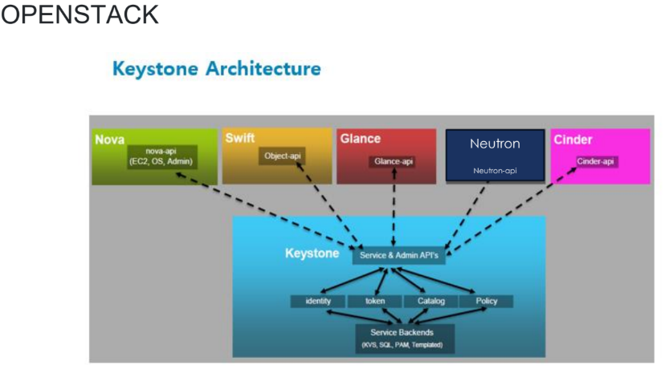
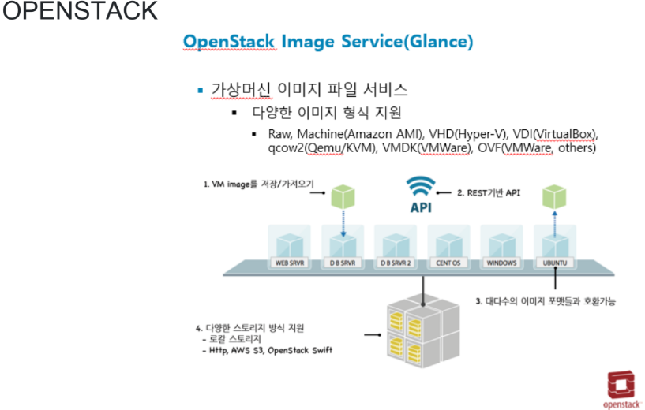
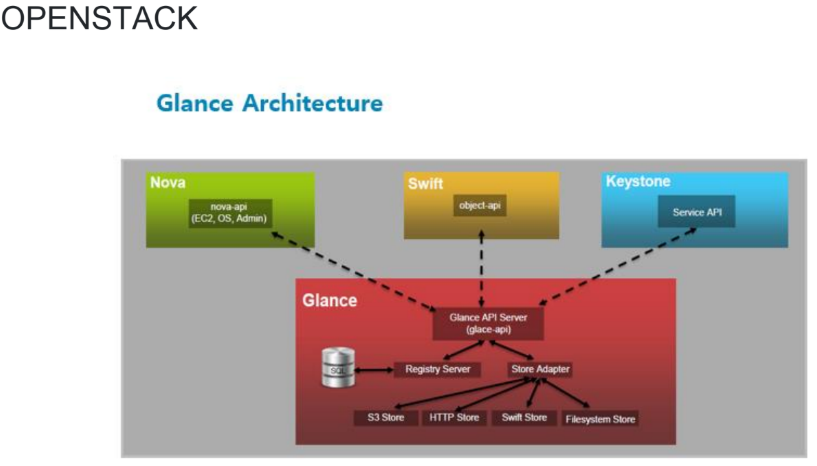
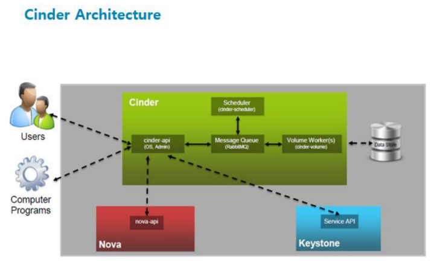
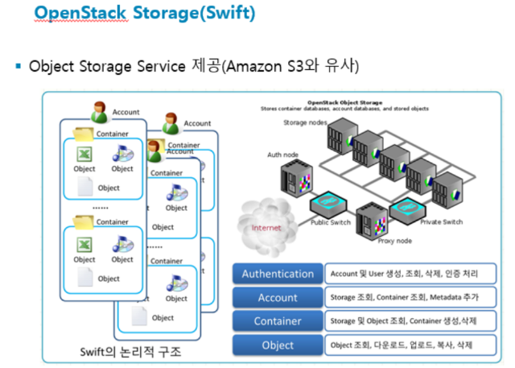

# 2026-08-21

## 태그
`EBS`

## 실습 내용

## 결론 / 배운 점

#### RAID
: 성능과 내장애성을 높이기 위한 목적

- 일곱 단계(0~6)
- RAID 0 : 가장 성능 좋음
- RAID 1 : 이중화(미러링) -> 가장 안정화, 한개가 깨져도 지장없도록.
- RAID 2 : 
- RAID 3 :
- RAID 4 : 비트/바이트 단위 전용 패리티 드라이브
- *RAID 5 : 블록 단위 패리티 정보 기록, RAID 3를 개선한거
- RAID 6 : 블록 단위에서 두가지 패리티 정보 기록
- RAID 10 : RAID 1을 스트라이핑 한 것, 성능과 안정성 모두 좋음
- RAID 50 : RAID 5 "
- 10과 01 차이 알아두기
    * 10 = Stripe + Mirror / 01보다 더 많이 사용

- - -
장애가 생겼을 떄 디그레이드를 통해 하지만 성능이 떨어짐

장애가 발생했을 때 디스크를 바로 교체하기 위해 `#핫스페어`

디스크 어레이 = 핫스페어 리스트를 뽑아놓음

스토리지 고급성능
- 썬 브로비저닝
- 자동 계층화
- 디둡
- 스냅 샷

#### 클라우드 스토리지
1. 블록 스토리지
- 파일 형태로 데이터를 저장
- 블록 단위로 I/O 진행
- 변경되는 부분만 업데이트
-> 효율적인 I/O 제공하는 스토리지 유형

2. 클라우드 볼륨 유형
- 특성과 성능이 달라 애플리케이션에 맞게 조정
- SSD : 작은 I/O의 읽기/쓰기 작업을 자주하는 트랜잭션에 최적화
- HDD : 대규모 스트리밍 워크로드에 최적화

3. 볼륨 백업 / 스냅 샷
- 스냅샷을 이용해 볼륨의 데이터를 백업할 수 있음
- 스냅샷은 하나, 스냅샷 이후 변경된 블록만 추가 저장됨
- 스냅샷을 만든 시점의 데이터를 새 볼륨에 복원하는데 필요한 정보 들어있음
- 암호화된 스냅샷은 자동으로 암호화

4. 파일 기반 시스템
- 네트워크 파일 시스템을 사용하는 파일 스토리지
- VPC 내에서 생성, 인터페이스를 통해 VM에 액세스
- 수천개 동시에 액세스 가능, 탄력적으로 오토 스캐일링 가능
- 미리 프로비저닝 할 필요 없음
- 페타바이트 단위로 확장 가능

5. 객체 스토리지
- 각 객체는 데이터, 메타데이터, 키로 구성
- 데이터는 이미지, 동영상, 텍스트 문서, 기타 유형의 파일
- 메타데이터는 내용, 사용방법, 크기에 대한 정보
- 키는 고유한 식별자

#### 인프라 운영
1. 장애 대응
- 
- 

2. 병목 해결
- 
- 

#### Private 클라우드 컴퓨팅
1. IaaS
- 
- 

2. PaaS
- 
- 

3. SaaS
- 
- 

4. 오픈스택
- 오픈스택 기반 : 카카오 , KT, 
- 기술면접 : 오픈스택에 대한 깊이있는 질문 X. 어느정도 수준으로 사용했냐, 서비스 이름이 뭔지만 정확하게 이해. 
AWS 기준으로(
워크로드/ Heat = IaC, Trove = Datebase
컴퓨트/ NOVA = EC2, JUN = ECS, 
저장소/ Swift = S3, Cinder = EBS, Mania = EFS, 
네트워크/ Neutron = VPC, Octavia = ELB, Designate = Rooute53
Shaped 서비스/ Keystone = IAM, Glance = AMI, Barbican = KeymanagerService)

- - -
1. Keystone

2. Nova

3. Glance (이미지 서비스)

4. Cinder

5. Swift

- 프로젝트 때 스토리지 쪽에서 Glance Sec?? 사용해보면 좋음

## 참고 링크
-
