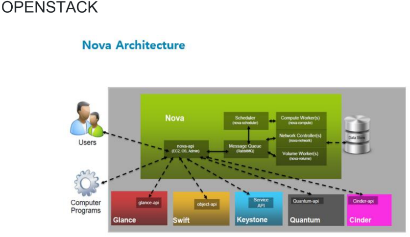

# 2026-08-21

## 태그
`EBS`

## 실습 내용

## 결론 / 배운 점

#### RAID
: 성능과 내장애성을 높이기 위한 목적

- 일곱 단계(0~6)
- RAID 0 : 가장 성능 좋음
- RAID 1 : 이중화(미러링) -> 가장 안정화, 한개가 깨져도 지장없도록.
- RAID 2 : 
- RAID 3 :
- RAID 4 : 비트/바이트 단위 전용 패리티 드라이브
- *RAID 5 : 블록 단위 패리티 정보 기록, RAID 3를 개선한거
- RAID 6 : 블록 단위에서 두가지 패리티 정보 기록
- RAID 10 : RAID 1을 스트라이핑 한 것, 성능과 안정성 모두 좋음
- RAID 50 : RAID 5 "
- 10과 01 차이 알아두기
    * 10 = Stripe + Mirror / 01보다 더 많이 사용

- - -
장애가 생겼을 떄 디그레이드를 통해 하지만 성능이 떨어짐

장애가 발생했을 때 디스크를 바로 교체하기 위해 `#핫스페어`

디스크 어레이 = 핫스페어 리스트를 뽑아놓음

스토리지 고급성능
- 썬 브로비저닝
- 자동 계층화
- 디둡
- 스냅 샷

#### 클라우드 스토리지
1. 블록 스토리지
- 파일 형태로 데이터를 저장
- 블록 단위로 I/O 진행
- 변경되는 부분만 업데이트
-> 효율적인 I/O 제공하는 스토리지 유형

2. 클라우드 볼륨 유형
- 특성과 성능이 달라 애플리케이션에 맞게 조정
- SSD : 작은 I/O의 읽기/쓰기 작업을 자주하는 트랜잭션에 최적화
- HDD : 대규모 스트리밍 워크로드에 최적화

3. 볼륨 백업 / 스냅 샷
- 스냅샷을 이용해 볼륨의 데이터를 백업할 수 있음
- 스냅샷은 하나, 스냅샷 이후 변경된 블록만 추가 저장됨
- 스냅샷을 만든 시점의 데이터를 새 볼륨에 복원하는데 필요한 정보 들어있음
- 암호화된 스냅샷은 자동으로 암호화

4. 파일 기반 시스템
- 네트워크 파일 시스템을 사용하는 파일 스토리지
- VPC 내에서 생성, 인터페이스를 통해 VM에 액세스
- 수천개 동시에 액세스 가능, 탄력적으로 오토 스캐일링 가능
- 미리 프로비저닝 할 필요 없음
- 페타바이트 단위로 확장 가능

5. 객체 스토리지
- 각 객체는 데이터, 메타데이터, 키로 구성
- 데이터는 이미지, 동영상, 텍스트 문서, 기타 유형의 파일
- 메타데이터는 내용, 사용방법, 크기에 대한 정보
- 키는 고유한 식별자

#### 인프라 운영
1. 장애 대응
- 
- 

2. 병목 해결
- 
- 

#### Private 클라우드 컴퓨팅
1. IaaS
- 
- 

2. PaaS
- 
- 

3. SaaS
- 
- 

4. 오픈스택
- 오픈스택 기반 : 카카오 , KT, 
- 기술면접 : 오픈스택에 대한 깊이있는 질문 X. 어느정도 수준으로 사용했냐, 서비스 이름이 뭔지만 정확하게 이해. 
AWS 기준으로(
워크로드/ Heat = IaC, Trove = Datebase
컴퓨트/ NOVA = EC2, JUN = ECS, 
저장소/ Swift = S3, Cinder = EBS, Mania = EFS, 
네트워크/ Neutron = VPC, Octavia = ELB, Designate = Rooute53
Shaped 서비스/ Keystone = IAM, Glance = AMI, Barbican = KeymanagerService)

- - -

1. Keystone(아키텍쳐) 

2. Nova(아키텍쳐)  

3. Glance (이미지 서비스) 

4. Cinder 

5. Swift 

6. 쿠버네티즈
- = 클러스트 운영체제
- 필요한 것들을 추가적으로 설치 후 실행해야함. 모니터링. (cncf.io)

- Control Plane = MASTER
- 컨테이너를 pod(파드) 단위로

- *Control Plane의 주요 커버노드는 API
- 커버노드의 에이전트들을 Kuvelet
- 노드의 리소스를 얼마나 사용하는지 체크

- 컨테이너 배포 받아 스케쥴링 후 API로 받으면 리퀘스트 후 전달, 도커와 같은 컨테이너 엔진 설치 되어 있음(요즘은 도커보다 containerd)
- 외부의 리퀘스트들을 수신할 수 있도록 해당 컴포넌트 필요.

_aws 시스템을 로컬에 설치하고 싶다 = 오픈스택_

**오픈스택 설치하는게 쉽지 않음. 따라서 이미지로 배포하면 노바서비스, 신더 완료되어 배포가 쉬워짐. 엔서블을 이용해서 배포할 수 있지만 helm을 이용하면 한번에 됨. 배포가 쉬워짐.리눅스 깔고 쿠버네티즈 클러스트링 하고 helm으로 배포.**

쿠버네티즈 위에 helm

- 프로젝트 때 스토리지 쪽에서 Glance Sec?? 사용해보면 좋음

- Cloud Native Landscape
: CNCF : 오픈소스 프로젝트를 지원하고 관리하는 비영리 단체 (성숙도 수준 = 졸업/ 인큐베이팅/ 샌드박스 순)

- 자주 쓰는 것 : Argo, Istio, Cilium, 클라우드에선 CNI, 스토리지 ROOK, MINIO

#### Migration
CAF -> WAF
1. AWS 클라우드 적용 프레임워크(CAF)
- 마이그레이션에 관여해야하는 다양한 역할에 초점을 맞춘 6영역
- 비즈니스, 인력, 거버넌스, 플랫폼, 보안, 운영 관점

2. AWS 응용프로그램 마이그레이션 전략6R. (WAF) 
- 서비스별 선별 해야함
    * 리호스팅 : 가상머신에 설치해 실행중인데, 기존거를 수정하지 않고 위치만 바꾸는 것
    * 리플랫포밍 : 위치를 바꿔 수정.
    * 리팩터링 : 재공사. 대규모
    * 재구매 : ERM(SAP), 기존 라이선스를 SaaS로 전환. 요즘은 클라우드 구독 형태로 많이 바꿈.
    * 유지 
    * 폐기 

3. AWS SNOW 패밀리를 통한 데이터 이전
* 온라인 = 마이그레이션, 오프라인 = USB
* AWS Snow
    * 온라인이 1주일 이상 걸린다면 대체로 사용.
    * 이동할 수 있는 물리적 디바이스

* AWS Snowcone
    * 엣지컴퓨팅(EC2 인스턴스) 및 데이터 전송 디바이스
    * CPU 2개, 4GB 메모리 및 8TB 스토리지

* AWS Snowball
    * 

* AWS Snowmobile
    * 트럭 트레일러 안에 스토리지를 빽빽히 넣어서 이동
    * 한대당 최대 100페타바이트
    * 서울 리전에선 서비스 불가

#### 가상화 및 기반기술
1. 가상화 제품
* oVirt (RHEV의 오픈소스 버전)
* vmware(여러 노트북을 붙일 땐 vCenter 서버)

2. 가상화 기반 네트워크 기술
* SDN : Software Defined Network
    * 해당 하는 것만 라우팅
    * 네트워크 장치의 기존 방식은 각 라우터에 알고리즘이 들어가고 각 라우터에서 제어 = 비용 증가, 복잡함 때문에 SDN이 생김
* 클라우드는 여러 사용자가 리소스를 공유해서 사용 = 서로 폐쇄망에서 그들만 공유

* NFV : network Functions Virtualization
    * 네트워크 기능 가상화

#### 리눅스

Debian 의 우분투 주로 사용
GCP는 데비안
레드햇은 안정성이 좋음
국내기업은 레드햇 많이 쓰는데 클라우드 넘어가면서 우분투 많이 씀

**레드햇 계열 Rocky 선정한 이유? CentOS와 같아서**
**일번 서버 목적이면 워크스테이션 설치 안함. 용량만 차지. 미니멀로 설치**

- **Virtual terminal(그래픽모드) : Ctrl + Alt + F1~7**

- SSH : secure shell = 아이디 로그인 외 키도 지원

- 사용자전환
    * 그래픽 모드 : 로그아웃
    * 터미널 : su
    * 루트계정으로 전환 : su - root  / 돌아가기 : exit

* address : a만 써도됨

* ls > /dev/pts/2 : 뒤에있는 주소에서 ls를 출력. (터미널 ssh)

* rsync : 매번 백업을 할 때 전체 소스를 복사하는게 아니라 변경된 것만 백업할 수 있음

* pkill : 전체종료

* Shell
    * 명령 해석기

* 커널 
    * 운영체제 핵심
    * 시스템, 드라이버 모듈
    * 커널 버전 : uname -r

* 파일 시스템

## 참고 링크
- 온프레미스 데이터 센터 구축 스냅사진
https://www.flickr.com/photos/vax-o-matic/2466376176/in/photostream/

- Azure 클라우드 데이타 센터
https://azure.microsoft.com/ko-kr/explore/global-infrastructure/geographies/#geographies

- 클라우드 스택기술
https://www.cncf.io/
